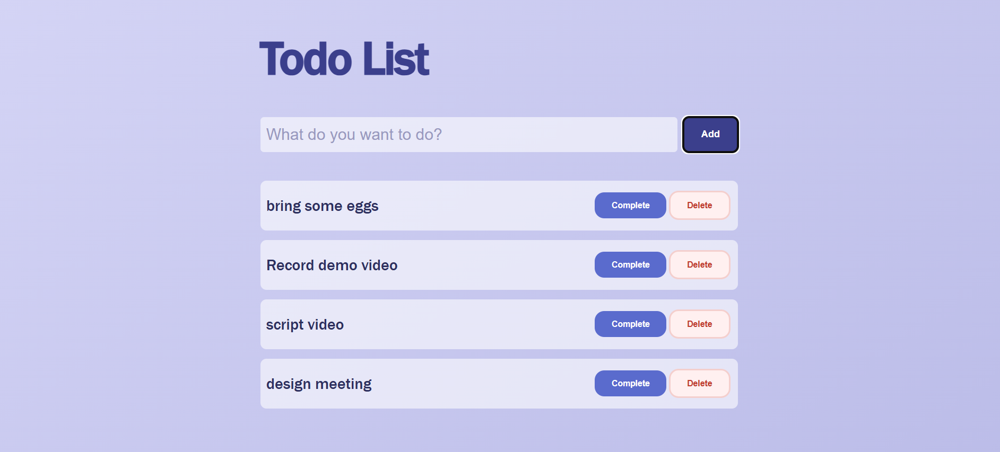

# To-Do App ✅

A simple To-Do app built with vanilla JavaScript.
Add, complete, and delete tasks with localStorage support.

---

## Features
- ➕ Add new tasks
- ✅ Mark tasks as completed
- 🗑️ Delete tasks
- 💾 Saves tasks using localStorage
- 🔄 Tasks persist after page refresh

---

## Tech Used
- HTML
- CSS
- JavaScript (Vanilla)

---

## How to Run
1. Clone the repo
2. Open `index.html` in your browser

---

## Screenshot

---

## Live Demo
[Click Here]( https://piyushdhakad001.github.io/js-todo-list/)

---

Made by **Piyush** 🚀